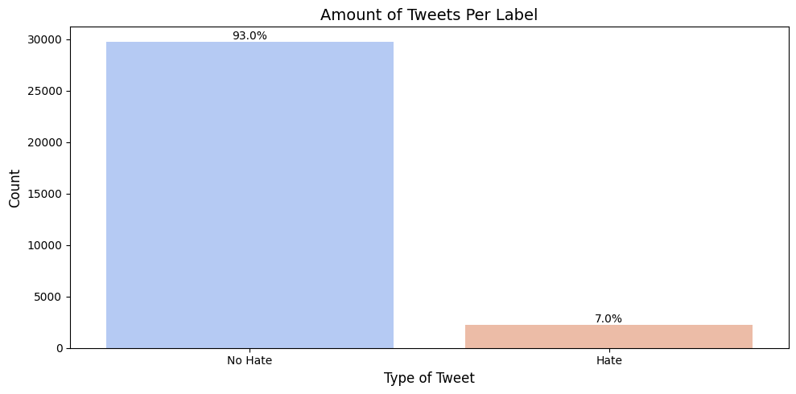
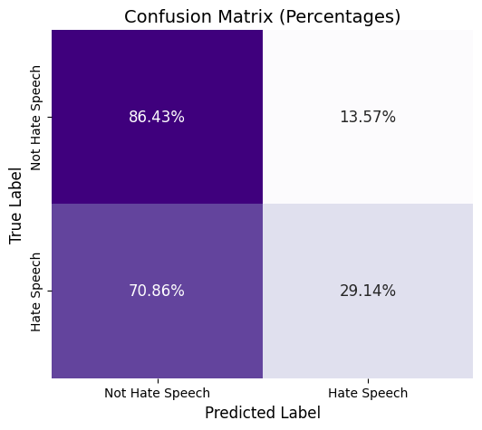
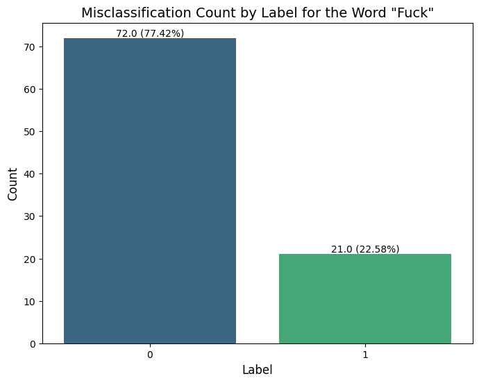
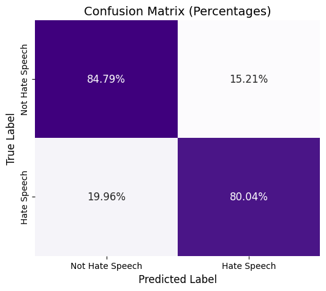

# Twitter Hate Speech Detection

## Overview

This project focuses on developing a **bi-directional LSTM model** for detecting hate speech in tweets. The dataset consists of labeled tweets, which are preprocessed by removing URLs, mentions, special characters, and expanding contractions. The data is then tokenized, padded, and balanced through class weighting to address class imbalance. The model architecture includes a bi-directional LSTM with dropout and batch normalization layers to improve generalization. WandB is used for tracking and visualizing training progress. The model is trained with early stopping to prevent overfitting. After training, the model is evaluated using accuracy and a confusion matrix. The model shows good performance, classifying tweets as either hate speech or not. The final model is hosted and can be used for real-time prediction on new tweets.

An **interactive version** of the final model is hosted on Huggingface. Check it out [here](https://huggingface.co/spaces/GokulRajaR/Hate_tweet_classification)!

## Business Problem
The project faces several challenges in hate speech detection, including a highly imbalanced dataset, where non-hate speech vastly outnumbers hate speech examples. The test data lacks labels, requiring predictions before performance can be assessed. These issues make it difficult to develop a reliable model that generalizes well across different types of content. Addressing these problems is crucial for building an effective hate speech detection system.

## Data Understanding
### 1. Data imbalance

The dataset exhibits a significant class imbalance, with non-hate speech tweets vastly outnumbering hate speech tweets. This imbalance can cause the model to be biased toward the majority class ("No Hate"), leading to poor performance on the minority class ("Hate"). In Natural Language Processing (NLP) tasks, data augmentation is a common approach to address such imbalance. However, due to limited resources, I did not use augmentation techniques in this project. Instead, I implemented class weighting to mitigate the impact of this imbalance during model training.

### 2. Missing Labels in test data
The test dataset is essential for evaluating the model's performance, but it is provided without labels. To overcome this, I utilized a pre-trained model from **Hugging Face(citizenlab/twitter-xlm-roberta-base-sentiment-finetunned)** to label the test data before making predictions and assessing the model’s performance.

### 3. Data Sourcing
The original dataset consists of a highly imbalanced distribution, with the following counts:
-Train Data: 29,720 non-hate tweets (label 0), 2,242 hate tweets (label 1)
-Test Data: 15,088 non-hate tweets (label 0), 2,109 hate tweets (label 1)
After preprocessing and removing noise, the dataset was refined to the following:
-Final Train Data: 25,349 non-hate tweets (label 0), 1,787 hate tweets (label 1)
-Final Test Data: 15,031 non-hate tweets (label 0), 2,108 hate tweets (label 1)
This cleaned and balanced dataset was used to train the hate speech detection model.

## Training 
For training, I used a Bidirectional LSTM (Long Short-Term Memory) model to capture the richness and context of tweets. This model was implemented using TensorFlow for efficient training and optimization.

To prevent overfitting and ensure the model only trains as long as it is improving, I incorporated Early Stopping functionality. This automatically halts the training process if the model's performance on the validation set stops improving, preventing unnecessary computations and helping to avoid overfitting.

For monitoring the training process and managing resources effectively, I used WandB (Weights and Biases). This tool allows for real-time visualization of training metrics, enabling better tracking of model performance, hyperparameters, and resource usage.

## Final Model Performance
The **F1 score**  was used as the primary evaluation metric for this model, while also considering Precision and Recall to provide a comprehensive assessment of its performance.

The final model achieves a True Negative Rate (TNR) of 86% and a True Positive Rate (TPR) of 29%. These values provide insight into the model's classification behavior:

The True Negative Rate indicates that 86% of non-hate speech tweets are correctly identified as regular content, which is a strong result, as we ideally want to identify non-hate speech as accurately as possible.
The True Positive Rate (29%) reflects the model's ability to identify hate speech, but it is relatively low, indicating room for improvement in capturing more instances of hate speech.

**Overall, the Recall of this model needs to be improved further, in addition to the F1 of 0.29.**

## Conclusion

**The final model's performance is indicative of the three major roadblocks of the project:**
1. The massive class imbalance of the dataset.
2. The inavailability of labels in the test dataset.
2. The model's inability to "understand" the nuances of hate speech.

The issue of class imbalance is manageable with preprocessing techniques and class weighting method. However, identifying hate speech and labeling the test data set is an overall problem.

Solution 2:

After noticing that my initial model wasn't performing well, I discovered a major issue: many hate speech tweets in the training dataset were mislabeled as non-hate speech. This mislabeling confused the model during training, leading to poor results when I tested it on correctly labeled data.

To solve this problem, I decided to ignore the original labels in the training data. Instead, I re-labeled all the training tweets using a pre-trained model from Hugging Face called citizenlab/twitter-xlm-roberta-base-sentiment-finetuned. This model is already good at identifying hate speech in tweets.

By using these new, more accurate labels, I provided my model with better data to learn from. I then retrained my Bidirectional LSTM model using this re-labeled dataset.

This change led to a significant improvement in my model's performance. The retrained model became much better at distinguishing between hate speech and non-hate speech tweets. You can see the improved results in the confusion matrix below.

In summary, by re-labeling the training data with a reliable pre-trained model and retraining my own model, I achieved better accuracy and reliability in detecting hate speech. The solution 2 focused on missclassification in the train dataset. this misclassification leads to poor performance in the evaluation with a proper classfied test dataset. most of the hate tweets are labeled as no hate.

## Final Model Deployment

An **interactive version** of the final model is hosted on Huggingface. Check it out [here](https://huggingface.co/spaces/GokulRajaR/Hate_tweet_classification)!

